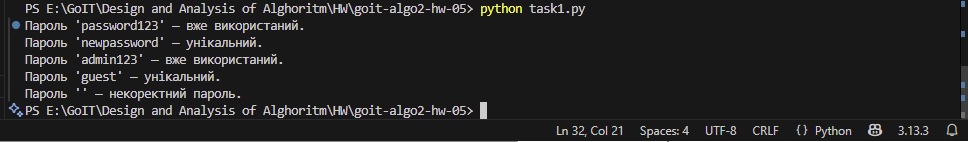
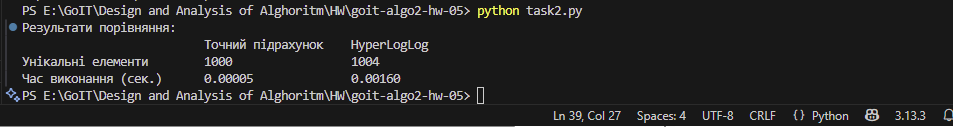

# Домашнє завдання до теми Bloom Filter та HyperLogLog 

У цьому репозиторії реалізовано два незалежні завдання, присвячені роботі з великими наборами даних та ефективним алгоритмам:
1. **Перевірка унікальності паролів за допомогою фільтра Блума**
2. **Порівняння продуктивності точного підрахунку та алгоритму HyperLogLog**

---

##  Завдання 1 — Перевірка унікальності паролів (Bloom Filter)

**Мета:**  
Реалізувати структуру даних **Bloom Filter**, яка дозволяє швидко перевіряти, чи зустрічався елемент раніше, використовуючи мінімум пам’яті.

**Функціонал:**
- Додавання елемента в фільтр.
- Перевірка наявності елемента.
- Перевірка списку паролів на унікальність.

##  Запуск
1. Клонуйте репозиторій git clone https://github.com/nata87/goit-algo2-hw-05
2. У терміналі виконайте:

```bash
python task1.py
```

--- 

## Результат 

### Завдання 1




---

# Завдання 2 — Порівняння продуктивності HyperLogLog із точним підрахунком

## Опис
Цей проєкт порівнює **точний підрахунок** кількості унікальних елементів (за допомогою `set`) та **наближену оцінку** за алгоритмом **HyperLogLog**.

Мета — продемонструвати, як можна швидко оцінювати кількість унікальних елементів у великих наборах даних із прийнятною похибкою, використовуючи менше пам’яті.

---

## 🗂 Вхідні дані
- Лог-файл `lms-stage-access.log`, який містить IP-адреси.
- Формат рядків може бути різним, але у файлі повинні бути коректні IPv4 адреси.
- Некоректні рядки ігноруються при обробці.

---

##  Запуск

1. Клонуйте репозиторій git clone https://github.com/nata87/goit-algo2-hw-05 

Перед запуском потрібно встановити бібліотеку:
```bash
pip install hyperloglog
```

2. У терміналі виконайте:

```bash
python task2.py
```

## Результат 

